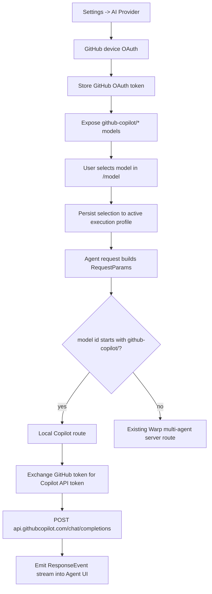

# GitHub Copilot AI Architecture

This document explains the AI-side implementation for routing Warp Agent requests through a user's GitHub Copilot subscription.

## High-Level Flow



## Token And HTTP Client

`app/src/ai/github_copilot_client.rs` contains two separate pieces:

- `GitHubCopilotOAuth`: starts and polls GitHub device OAuth.
- `GitHubCopilotClient`: exchanges the GitHub OAuth token for a short-lived Copilot API token and sends chat completion requests.

The Copilot exchange is:

1. Read GitHub OAuth token from local state, secure storage, or `GITHUB_TOKEN`.
2. `GET https://api.github.com/copilot_internal/v2/token` with `Authorization: token <github_token>`.
3. Cache the returned `token` until `expires_at - 60s`.
4. `POST https://api.githubcopilot.com/chat/completions` with `Bearer <copilot_token>`.

Required headers are set in `default_headers()`:

- `User-Agent: Warp`
- `Accept: application/json`
- `Content-Type: application/json`
- `editor-version: vscode/1.95.0`
- `Copilot-Integration-Id: vscode-chat`

The HTTP client uses HTTP/1.1, connection/request timeouts, and retries retryable transport errors. This was added after local testing saw TLS handshake EOFs from `api.github.com` even though `curl` could reach the same endpoint.

## Local Token Storage

In debug builds or OSS channel:

- GitHub Copilot OAuth token is stored at `paths::state_dir()/github_copilot_oauth_token`.
- This avoids repeated macOS Keychain prompts during local development.

In non-debug/non-OSS builds:

- The token uses Warp secure storage under `github_copilot_oauth_token`.

Do not confuse this token with Warp's own login/session secrets. The Copilot token storage was intentionally scoped to `github_copilot_client.rs`.

## Model List

`app/src/ai/llms.rs` adds:

- `LLMProvider::GitHubCopilot`
- `GITHUB_COPILOT_MODEL_ID_PREFIX = "github-copilot/"`
- `is_github_copilot_model_id()`
- `github_copilot_model_name()`
- `augment_with_github_copilot_models()`

In this local subscription mode, `augment_with_github_copilot_models()` replaces the agent/coding/CLI-agent model choices with Copilot-routed models. It does not append Copilot models to the regular server-provided list. This is deliberate: regular Warp server/BYOK models do not use the GitHub Copilot OAuth token, so showing them in this mode would let users select models that do not route through their subscription.

Model IDs use this pattern:

```text
github-copilot/<provider-model-id>
```

Example:

```text
github-copilot/gpt-4.1
github-copilot/claude-sonnet-4.5
github-copilot/gemini-2.5-pro
```

The display name includes the source, for example:

```text
GPT-4.1 from GitHub Copilot
```

## Model Persistence Across Sessions

Before this integration, `LLMPreferences::update_preferred_agent_mode_llm()` primarily managed a pane-level override in `base_llm_for_terminal_view`. That meant a newly-created session could fall back to the active profile's default.

Now selecting a model does two things:

1. Updates the current pane override.
2. Persists the model into the active execution profile's `base_model`.

That means the next session inherits the last selected model through normal execution-profile lookup. No separate "default Copilot model" setting is needed.

## Agent Routing

`app/src/ai/agent/api/impl.rs` keeps the existing multi-agent server path for non-Copilot models. It adds an early branch:

```rust
if is_github_copilot_model_id(&params.model) {
    return generate_github_copilot_output(params, cancellation_rx).await;
}
```

The local Copilot route:

1. Converts the current request and known conversation messages to OpenAI chat messages.
2. Calls `GitHubCopilotClient::from_local_dev_storage_or_env()`.
3. Sends a non-streaming chat completion request.
4. Converts the response into `warp_multi_agent_api::ResponseEvent` values:
   - `StreamInit`
   - optional `CreateTask` if this is a new local conversation with no server task
   - `AddMessagesToTask` containing `ModelUsed` and `AgentOutput`
   - `StreamFinished(Done)`

The optional `CreateTask` matters for fresh conversations. Without it, the local route has no server task ID to attach response messages to and the Agent UI reports a missing target task.

## Limitations

This route currently implements text chat completions, not full Warp multi-agent orchestration.

Not supported by the local Copilot route yet:

- Warp server-side tools
- Subagents/orchestration
- Server-side web retrieval
- Full tool call loops
- Warp usage/cost metadata

The UI intentionally labels model output as GitHub Copilot so users can tell which route handled the response.
