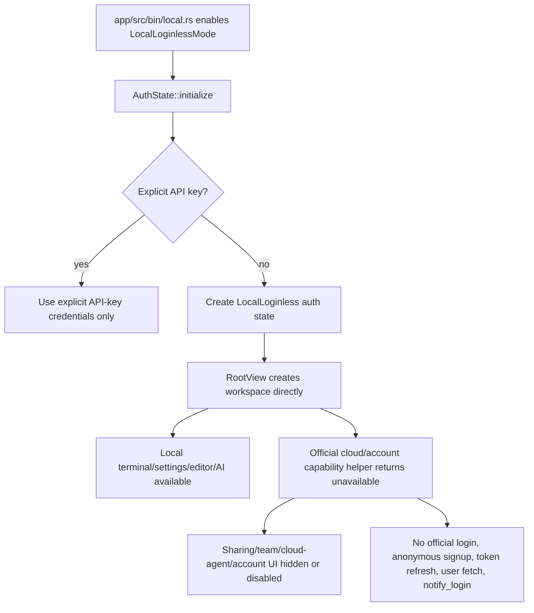

# Local Loginless Mode Tech Spec

## Context

This spec implements the behavior in `specs/local-loginless-mode/PRODUCT.md`.

Current auth is centered on `AuthState` and `AuthManager`:

- `app/src/auth/auth_state.rs:82` initializes auth by checking test/skip-login mode, explicit API key, `WARP_USER_SECRET`, then persisted Firebase user from secure storage.
- `app/src/auth/auth_state.rs:136` treats `test`, `skip_login`, and integration channel as test-user modes.
- `app/src/auth/auth_state.rs:232` defines "logged in" as "credentials exist".
- `app/src/auth/auth_state.rs:242` treats no credentials or Firebase anonymous users as lacking a full account.
- `app/src/auth/auth_manager.rs:254` refreshes the current official user if credentials have a login token.
- `app/src/auth/auth_manager.rs:272` starts OAuth device auth.
- `app/src/auth/auth_manager.rs:326` handles fetched official users and then starts many official-account side effects: experiments, cloud preference sync, request-usage fetch, team/cloud polling, shared-session rejoin, privacy server sync, telemetry flush, and `notify_login`.
- `app/src/auth/auth_manager.rs:531` persists Firebase users to secure storage or removes credentials on logout.

There are already partial loginless mechanisms, but neither is the right architectural base by itself:

- `FeatureFlag::ForceLogin` forces auth UI in preview builds (`app/src/bin/preview.rs:16`, `app/src/auth/auth_view_body.rs:188`).
- `FeatureFlag::SkipFirebaseAnonymousUser` skips anonymous Firebase user creation (`crates/warp_features/src/lib.rs:798`, `app/src/root_view.rs:1701`, `app/src/auth/login_slide.rs:402`, `app/src/auth/auth_view_modal.rs:277`), but it leaves the app fully logged out and still disables features through "anonymous or logged out" gates.

Representative login/account gates:

- `app/src/root_view.rs:1688` routes unauthenticated startup to auth, onboarding, skip-login workspace, or terminal.
- `app/src/drive/settings.rs:43` disables Warp Drive when `SkipFirebaseAnonymousUser` is enabled and the user is anonymous/logged out.
- `app/src/workspace/action.rs:693` marks team drive and session-sharing actions as blocked for anonymous users.
- `app/src/drive/index.rs:4882` opens auth for object sharing when anonymous/logged out.
- `app/src/drive/index.rs:5212` opens auth for anonymous/logged-out users performing team actions.
- `app/src/ai/blocklist/agent_view/agent_input_footer/mod.rs:1868` disables remote-control when anonymous/logged out.
- `app/src/lib.rs:1435` records logged-out startup when no official user exists.
- `app/src/lib.rs:2879` wires compile-time `skip_firebase_anonymous_user` into runtime flags.

Architectural decision: do not reuse `User::test()` or globally redefine `is_logged_in()` for production local-loginless behavior. A local-only fork identity must be distinguishable from an official Warp account, because treating it as a real account risks enabling server-backed sharing, team, billing, cloud-agent, and entitlement paths.

## Proposed Changes

### 1. Add a product-level runtime flag

Add `FeatureFlag::LocalLoginlessMode` in `crates/warp_features/src/lib.rs`, near the existing auth/account flags. This is a product-level flag, not a per-call-site switch.

Enable it by default in the fork's local entry point:

- `app/src/bin/local.rs`: add `.with_additional_features(&[features::FeatureFlag::LocalLoginlessMode])`.

Do not enable it in `app/src/bin/preview.rs`; preview can remain useful for comparing official-login behavior. If this fork later needs all binaries to be loginless, that should be a conscious follow-up.

Keep `FeatureFlag::SkipFirebaseAnonymousUser` available but stop treating it as the primary identity model for this feature. It can remain a narrower behavior flag for the old "skip login but be logged out" path.

### 2. Add explicit auth identity mode

Extend `AuthState` with an explicit identity mode:

```rust
pub enum AuthIdentityMode {
    Official,
    LocalLoginless,
}
```

Store it in `AuthState` as a small immutable-or-locked field initialized at construction. Add focused helpers:

- `is_local_loginless(&self) -> bool`
- `has_official_account(&self) -> bool`
- `requires_official_account_for_cloud(&self) -> bool` or equivalent naming
- `is_local_workspace_available(&self) -> bool`

Do not change `is_logged_in()` to return `true` for local-loginless mode. That method should continue to mean official credentials exist. This preserves existing assumptions in network/client code.

In `AuthState::initialize`:

1. If `FeatureFlag::LocalLoginlessMode.is_enabled()` and no explicit API key was provided, initialize `AuthIdentityMode::LocalLoginless`.
2. Do not read `WARP_USER_SECRET`.
3. Do not read or apply persisted Firebase secure-storage users.
4. Do not set Firebase, test, or session-cookie credentials.
5. Preserve the existing `anonymous_id`; it remains useful for local telemetry or local identifiers.

If an explicit API key is provided, keep the existing API-key path because it is user-supplied. It should still not cause automatic Firebase user restoration.

Add test constructors for local-loginless auth state. Do not use `User::test()` for this path.

### 3. Centralize official cloud availability checks

Add a small helper module in `app/src/auth` or `app/src/cloud_capabilities.rs`:

```rust
pub fn official_warp_account_available(ctx: &AppContext) -> bool
pub fn official_warp_cloud_enabled(ctx: &AppContext) -> bool
pub fn local_loginless_mode(ctx: &AppContext) -> bool
```

The helper should combine:

- `FeatureFlag::LocalLoginlessMode`
- `AuthState::has_official_account()`
- Any existing feature flag needed for the specific cloud surface

Use this helper at UI and model boundaries instead of scattering raw `FeatureFlag::LocalLoginlessMode` checks everywhere. The goal is to keep the fork mode easy to audit.

### 4. Startup and onboarding

Update `app/src/root_view.rs` so `LocalLoginlessMode` wins before `ForceLogin` for the local fork path:

1. If local-loginless is enabled, create the workspace directly.
2. Do not show login, sign-up, anonymous signup, login-later, or reauth UI.
3. If non-account onboarding is still needed, it must be routed as local preference onboarding and must not include official account steps.

Keep the official `ForceLogin` branch intact for binaries that do not enable `LocalLoginlessMode`.

Remove or bypass logged-out startup reporting in local-loginless mode (`app/src/lib.rs:1435`). Local-loginless is not an abandoned signup funnel; it is the expected state.

### 5. AuthManager behavior in local-loginless mode

Guard official-account operations in `AuthManager`:

- `refresh_user` should no-op in local-loginless mode.
- `authorize_device` should not start device auth in local-loginless mode.
- `create_anonymous_user` should emit `SkippedLogin` or a local-unavailable event instead of calling the server.
- `initialize_user_from_auth_payload` should ignore or explicitly reject browser auth redirects unless the app is in official-login mode.
- `resume_interrupted_auth_payload` should not run in local-loginless mode.

Do not route local-loginless through `on_user_fetched`; that function's side effects are official-account side effects. If any side effect is needed locally, split it into a local-specific method rather than calling the official user-fetched path.

### 6. Disable official cloud/account surfaces without login prompts

Replace "anonymous/logged out -> open login" behavior with local-loginless-aware behavior:

- `WorkspaceAction::blocked_for_anonymous_user` can remain as the official-account gate, but handling should branch:
  - official mode: keep existing login modal behavior.
  - local-loginless mode: hide the action or show a local-fork unavailable message.

- `DriveIndex::toggle_share_dialog` and `DriveIndex::handle_action` should not call `AuthManager::attempt_login_gated_feature` in local-loginless mode. They should disable/hide share/team actions or show the local-unavailable message.

- Remote-control/session-sharing chips should remain disabled in local-loginless mode, but the tooltip should say the feature requires Warp-hosted sharing services in this build rather than "Log in".

- User menu/avatar rendering in `app/src/workspace/view.rs` should not show sign-in/sign-up affordances. Prefer a neutral "Local" identity label or no account section.

- Reauth prompts should be suppressed in local-loginless mode, because there is no official account session to refresh.

### 7. Local persistence and Drive naming

Do not make all `CloudModel` surfaces disappear just because their historical type names contain "cloud". This codebase uses CloudModel for notebooks, workflows, env var collections, prompts, and other objects that may have local persistence paths.

Implementation should audit each object type before disabling it:

- Keep local object creation/editing where the object can be stored locally without official sync.
- Disable share, team spaces, server IDs, permissions editing, billing banners, and cloud sync status for local-loginless mode.
- Ensure anonymous-user object limits return "not limited" in local-loginless mode.
- Update `WarpDriveSettings::is_warp_drive_enabled` so local-loginless does not accidentally disable local object navigation just because the user is logged out.

If an object cannot currently be saved without sync, disable that specific object type with a clear local-unavailable message rather than letting creation fail later.

### 8. Privacy, telemetry, and update side effects

Local-loginless privacy settings are local settings:

- Do not call account-scoped privacy fetch/update during startup.
- Keep local settings for telemetry and crash reporting.
- Do not send official login, identify, or `notify_login` events in local-loginless mode.
- Autoupdate and channel-version checks need a separate decision: if they call public non-account endpoints, they may remain; if they depend on official account state, gate them behind official cloud availability.

### 9. AI and agent surfaces

Keep user-owned AI/provider flows:

- BYOK/custom provider credentials.
- AWS/GitHub/SSH/MCP/provider-specific login prompts.
- Local agent sessions and local CLI agent workflows.

Disable official Warp-hosted surfaces:

- Cloud agents / cloud mode.
- Cloud conversations.
- Agent shared sessions / remote control.
- Official account request usage/quota fetches.
- Anonymous-user AI request-limit alerts.

Prefer capability helpers over raw feature flags where possible: a feature flag may still be enabled in the local binary because `app/src/bin/local.rs` enables dogfood and preview flags, but the capability should be unavailable when `LocalLoginlessMode` is active.

## End-to-End Flow



## Testing and Validation

Unit tests:

1. `app/src/auth/auth_state` tests:
   - With `LocalLoginlessMode` enabled and no API key, `AuthState::initialize` creates local-loginless state, has no credentials, has no user id, is not an anonymous Firebase user, and reports local workspace availability.
   - With `LocalLoginlessMode` enabled and an explicit API key, API-key credentials remain available.
   - Local-loginless initialization does not apply `WARP_USER_SECRET` or persisted Firebase users.

2. `app/src/auth/auth_manager` tests:
   - `refresh_user`, `authorize_device`, and `create_anonymous_user` do not call the auth client in local-loginless mode.
   - Login-gated events are not emitted as login prompts in local-loginless-only paths.

3. Capability helper tests:
   - Official cloud is unavailable in local-loginless mode even when cloud-related feature flags are enabled.
   - Official cloud remains available in official mode when the user has a non-anonymous official account and the relevant feature flag is enabled.

UI/model tests:

4. `root_view` startup test for PRODUCT Behavior 1-4:
   - Local-loginless clean startup creates a workspace directly and does not instantiate login UI.

5. Representative gated action test for PRODUCT Behavior 8-9:
   - Trigger a share/team action in local-loginless mode and assert it does not emit `AuthManagerEvent::AttemptedLoginGatedFeature`.
   - Assert the action is hidden, disabled, or produces the local-unavailable message.

6. Drive/local object test for PRODUCT Behavior 12-13:
   - Local object creation is not blocked by anonymous-user limits.
   - Local persistence survives app/model reinitialization where an existing test harness supports it.

7. AI/provider test for PRODUCT Behavior 16:
   - AWS/provider credential missing UI remains provider-specific and does not become a Warp official login prompt.

Manual validation:

8. Run a clean local profile:
   - `cargo run`
   - Confirm first usable screen is a local workspace/terminal, not login.
   - Restart app and confirm no account prompts.

9. Exercise account-backed surfaces:
   - Sharing/session remote-control/team drive/cloud mode should not open login; they should be absent, disabled, or local-unavailable.

10. Run quality gates:
   - `cargo fmt`
   - Focused unit/UI tests added above.
   - Broader `cargo nextest run --no-fail-fast --workspace --exclude command-signatures-v2` before merging if time permits.

## Risks and Mitigations

1. Risk: `CloudModel` contains both cloud-backed and local-persisted object behavior.
   - Mitigation: gate only server-backed actions first; avoid deleting object models wholesale.

2. Risk: local binary enables dogfood/preview feature flags, so cloud features may appear despite loginless mode.
   - Mitigation: use capability helpers that include `LocalLoginlessMode`, not feature flags alone.

3. Risk: changing `is_logged_in()` semantics would accidentally enable official account paths.
   - Mitigation: keep `is_logged_in()` tied to credentials and add explicit local-loginless helpers.

4. Risk: background pollers continue hitting official endpoints.
   - Mitigation: guard `AuthManager` official-user side effects and audit update managers that start on auth completion.

5. Risk: tests using `User::test()` mask production local-loginless gaps.
   - Mitigation: add separate local-loginless test constructors and tests.

## Parallelization

Once this TECH.md is approved, work can split cleanly:

- `rust-core-dev`: feature flag, `AuthState` identity mode, `AuthManager` guards, auth tests.
- `ui-dev`: root view startup path, user menu/login prompt removal, gated action messaging.
- `infra-dev`: official cloud capability helper, cloud sync/poller guards, local persistence audit.
- `ai-agent-dev`: cloud agent/shared-session/request-limit gates while preserving local/provider AI flows.

All workers should treat `specs/local-loginless-mode/PRODUCT.md` and this TECH.md as the contract and avoid broad deletion of auth code unless it is proven unreachable in local-loginless mode.
